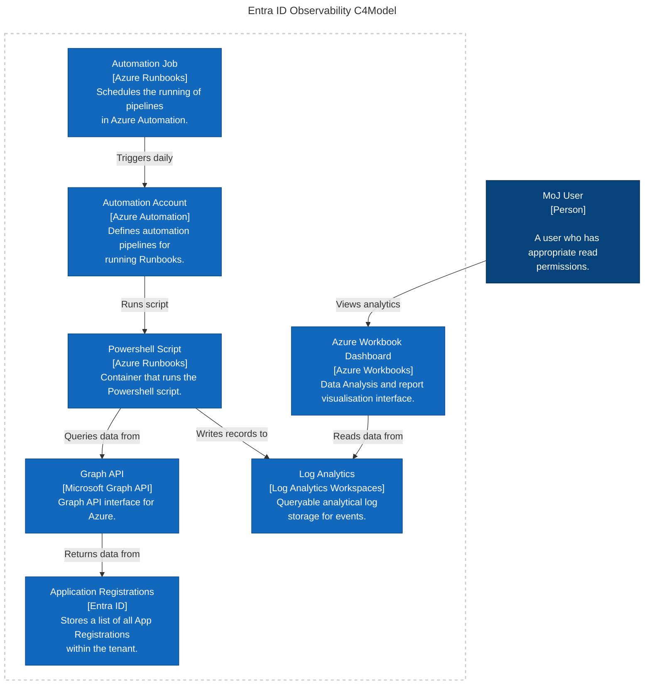

# Flowcharts

```mermaid
---
title: "Entra ID Observability C4Model"
---
flowchart TD
    User["MoJ User
    [Person]
    
    A user who has appropriate read\npermissions."]

    AR["Application Registrations
    [Entra ID]
    Stores a list of all App Registrations\nwithin the tenant."]

    GAPI["Graph API
    [Microsoft Graph API]
    Graph API interface for Azure."]

    AA["Automation Account
    [Azure Automation]
    Defines automation pipelines for\nrunning Runbooks."]

    PS["Powershell Script
    [Azure Runbooks]
    Container that runs the Powershell script."]

    AJ["Automation Job
    [Azure Runbooks]
    Schedules the running of pipelines\nin Azure Automation."]

    LA["Log Analytics
    [Log Analytics Workspaces]
    Queryable analytical log\nstorage for events."]

    AWD["Azure Workbook Dashboard
    [Azure Workbooks]
    Data Analysis and report visualisation interface."]

    User-- "Views analytics" -->AWD

    subgraph observability-service[Entra ID Observability Service]
        AWD-- "Reads data from" -->LA

        PS-- "Writes records to" -->LA

        AJ-- "Triggers daily" -->AA

        AA-- "Runs script" -->PS

        PS-- "Queries data from" -->GAPI

        GAPI-- "Returns data from" -->AR
        
    end

    %% Styling
    classDef container fill:#1168bd,stroke:#0b4884,color:#ffffff
    classDef person fill:#08427b,stroke:#052e56,color:#ffffff
    classDef supportingSystem fill:#666666,stroke:#0b4884,color:#ffffff

    class User person
    class AR,GAPI,AA,AWD,LA,PS,AJ container
    class TS,K,RS,SS supportingSystem

    style observability-service fill:none,stroke:#CCCCCC,stroke-width:2px
    style observability-service color:#FFFFFF,stroke-dasharray: 5 5,stroke-width:2px
```
