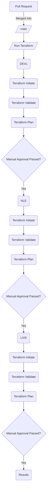

```mermaid
flowchart TD
    A[Pull Request] -->|Merged into| B[/main/]
    B --> tf[/Run Terraform/]
    
    tf --> devl(DEVL)

    devl --> tfinit_devl(Terraform Initiate)
    tfinit_devl --> tfvalidate_devl(Terraform Validate)
    tfvalidate_devl --> tfplan_devl(Terraform Plan)
    tfplan_devl --> approve_devl{Manual Approval Passed?}
    
    approve_devl{Manual Approval Passed?}
    approve_devl -- Yes --> nle

    nle(NLE) --> tfinit_nle(Terraform Initiate)
    tfinit_nle --> tfvalidate_nle(Terraform Validate)
    tfvalidate_nle --> tfplan_nle(Terraform Plan)
    tfplan_nle --> approve_nle{Manual Approval Passed?}

    approve_nle -- Yes --> live

    live(LIVE) --> tfinit_live(Terraform Initiate)
    tfinit_live --> tfvalidate_live(Terraform Validate)
    tfvalidate_live --> tfplan_live(Terraform Plan)
    tfplan_live --> approve_live{Manual Approval Passed?}

    approve_live -- Yes --> final(Results)
```