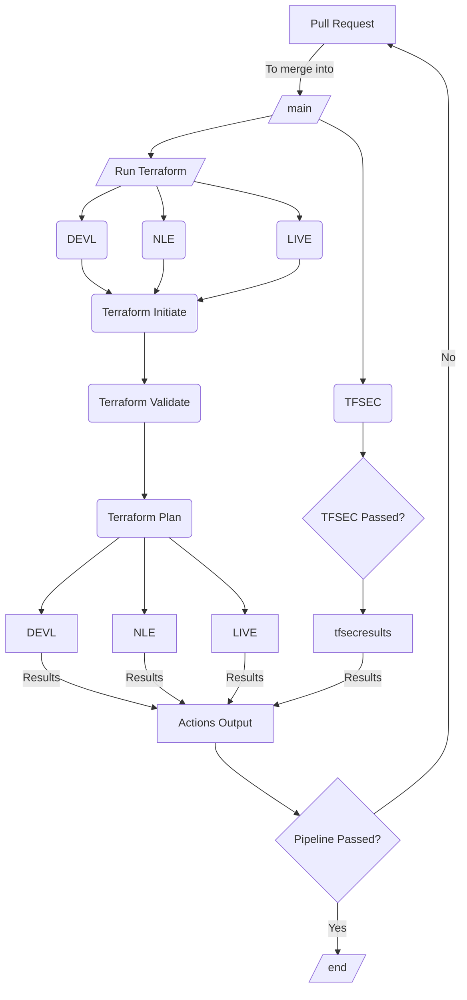

```mermaid
flowchart TD
    A[Pull Request] -->|To merge into| B[/main/]
    B --> tfsec(TFSEC)
    tfsec --> tfsecdecision{TFSEC Passed?}
    tfsecdecision --> tfsecresults
    B --> tf[/Run Terraform/]
    tf --> devl(DEVL)
    tf --> nle(NLE)
    tf --> live(LIVE)
    devl --> tfinit(Terraform Initiate)    
    nle --> tfinit(Terraform Initiate)
    live --> tfinit(Terraform Initiate)
    tfinit --> tfvalidate(Terraform Validate)
    tfvalidate --> tfplan(Terraform Plan)
    tfplan --> D[DEVL]
    tfplan --> E[NLE]
    tfplan --> F[LIVE]
    D -->|Results| final
    E -->|Results| final
    F -->|Results| final
    tfsecresults -->|Results| final[Actions Output]    
    final --> pipelineresult{Pipeline Passed?}
    pipelineresult -- Yes --> pipelineend[/end/]
    pipelineresult -- No --> A
```